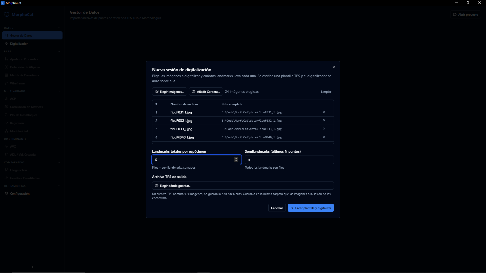
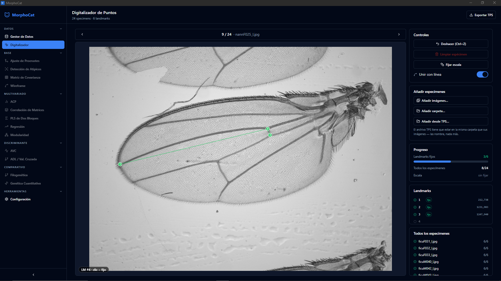
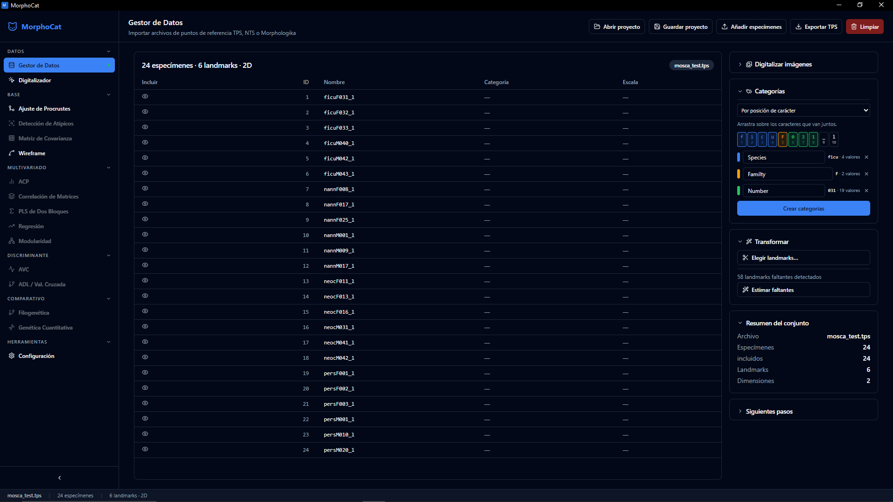
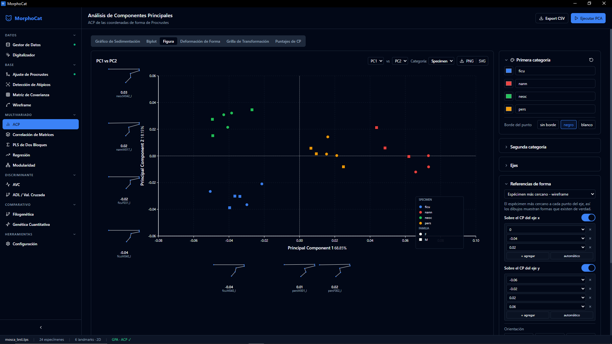

# MorphoCat

Geometric morphometrics on your desktop: digitize landmarks, align them, run the
analyses, export publication figures. No Python or R to install. Works offline.

Free and open source, and a reimplementation of MorphoJ.

[Español](README.es.md)

## Install

Download from [Releases](https://github.com/Nispeter/MorphoCat/releases) and open it.

| System | File |
| --- | --- |
| Windows | `MorphoCat_<version>_x64-setup.exe` |
| Windows (IT deployment) | `MorphoCat_<version>_x64_en-US.msi` |
| Debian / Ubuntu | `MorphoCat_<version>_amd64.deb` |
| Other Linux | `MorphoCat_<version>.AppImage` |

If Windows says *"Windows protected your PC"*: **More info → Run anyway**.

No macOS build yet. It runs there, but has to be
[built from source](docs/DEVELOPING.md).

English and Spanish — switch in **Settings**.

## Use

Everything starts in the **Data Manager**.

Want to poke at it first? [`data/mosca_test.tps`](data/mosca_test.tps) is a real
24-specimen fly-wing dataset — drag it in and skip to step 3.
[`data/mosca_test.morphocat.json`](data/mosca_test.morphocat.json) is the same
data as a finished project, categories and figure styling included.

### 1. Load your landmarks

Already have a `.tps`, `.nts` or Morphologika `.txt`? Drag it onto the drop zone.

Starting from photographs? **Pick Images** or **Add Folder**, then set how many
landmarks each specimen gets and where to save the `.tps`.

> Keep the `.tps` in the same folder as the photos. TPS files store image
> *names*, not paths — separate them and the app cannot find your images.

### 2. Digitize

| | |
| --- | --- |
| Place a landmark | Click |
| Place a semilandmark | **Shift** + click |
| Undo | **Ctrl+Z** |
| Next / previous specimen | **→** / **←** |
| Real-world scale | **Set scale** → click two points → type the distance |
| More photos later | **Add specimens** |

When all specimens are done: **Load as Dataset**.

### 3. Split IDs into categories

Open **Categories**. Drag across the characters that belong together and name
them — `26-13MA020230` becomes site, level, whatever you encoded. For separated
IDs like `ficu_F_031`, switch to **By separator** and click a part. Then
**Apply**.

### 4. Align

**Procrustes Fit → Run.** Removes position, size and rotation. Every other
analysis needs it first.

### 5. Check for mistakes

**Outlier Detection** ranks specimens by distance from the mean shape. A far
outlier is usually a digitizing slip — click to review it. Swapped landmark
numbers can be fixed there, across the whole dataset.

### 6. Analyse

**PCA** first, normally. Its **Figure** tab builds the publication plot: colour
by one category, symbols by another, shape drawings along the axes, draggable
legend, PNG or SVG export.

Also in the sidebar: covariance matrices, matrix correlation, two-block PLS,
regression and allometry, modularity, CVA, LDA with cross-validation,
phylogenetic comparative methods, quantitative genetics.

### 7. Save

**Save project** writes one `.morphocat.json` holding data, categories,
alignment, figure styling and your digitizing session. Tables export to CSV,
charts to PNG or SVG.

## Notes

- Nothing is uploaded or tracked. There are no network requests.
- Import: TPS, NTS, Morphologika. Export: TPS, CSV.
- 3D works for import and the core analyses; missing-landmark estimation is 2D.
- Antivirus false positives happen with how the compute engine is packaged. The
  Releases page is the only official source.

## More

[Building from source](docs/DEVELOPING.md) ·
[Code signing](docs/CODE_SIGNING_POLICY.md) ·
[References](REFERENCES.md) ·
[MIT licence](LICENSE)

Citing MorphoCat? Cite MorphoJ too:

> Klingenberg, C. P. 2011. MorphoJ: an integrated software package for geometric
> morphometrics. *Molecular Ecology Resources* 11: 353–357.
